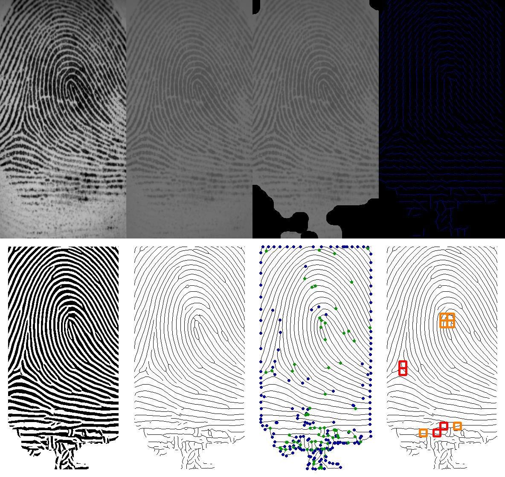

# Fingerprint-Minutiae-Extraction

## Summary

This project was forked from [fingerprint_recognition](https://github.com/cuevas1208/fingerprint_recognition)

### How to run

**Install requirements**

    pip install -r requirements.txt

**Run fingerprint-minutiae-extraction code**

    python main.py

### Stages of the Fingerprint-Minutiae-Extraction Algorithm

The performance of minutiae extraction algorithms and other fingerprint recognition techniques relies heavily on the quality of the fingerprint images, and thus, pre-processing is a very important step.

The stages of pre-processing are as follows:

* Grayscale Transformation

* Image Normalization

* Segmentation

* Directional Map

* Frequency Map

* Gabor's Filtering

* Skeletonization

* Minutiae Detection

* Singularity Detection

### Dataset

Dataset used for this project can be found [here](http://bias.csr.unibo.it/fvc2002/download.asp).

### Results

The output images contain result of each pre-processing step.

